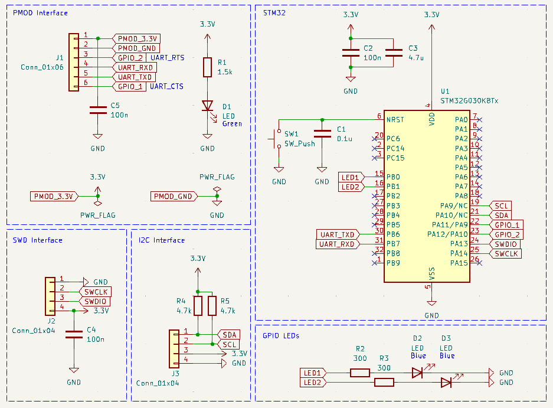
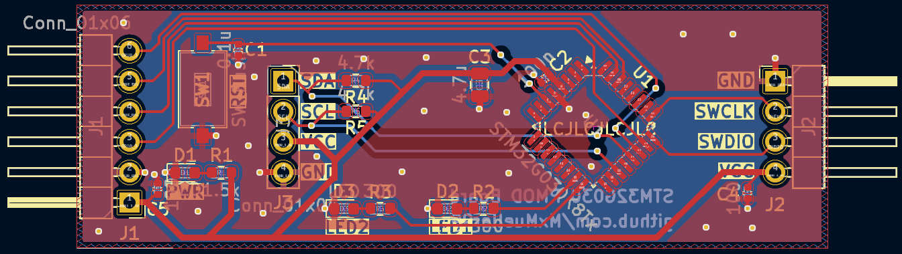
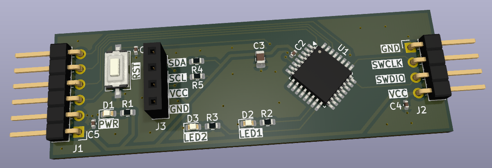

# STM32-PMOD
A compact and cheap PMOD compatible **STM32G030K8T6** based PCB. 

# Demo

# Features
- Arm Cortex-M0+ MCU, 64 MHz CPU, 64 KB Flash, 8 KB RAM
- STM32 USART1 TX/RX routed to the PMOD connector (Pin 2 & 3)
- Two onboard programmable LEDs
- I2C interface pins (For displays or sensors)
- SWD Interface for debugging/flashing the STM32 

# Hardware Overview

## Schematic

## Layout

## 3D Render

# Example - UART Blink

A small example to demonstrate the UART capabilities between the Arty Z7-20 Zynq PS and the STM32G030 MCU located under: `/UART_Blink_Example/`

- FPGA: Sends a UART message periodically to the STM32
- STM32: Receives the UART message and toggles the LED
    - "LED1" blinks when receiving UART messages from the FPGA
    - "LED2" blinks as a heartbeat of the STM32

## Setup
1. Connect the PMOD board to the FPGA
2. Flash the STM32 example via the SWD pins
3. Program the FPGA and run the example in Vitis

The FPGA needs to have the UART enabled and the uart_tx pin routed to the PMOD connector pin 3.

# Example - UART OLED

Another example to display incoming UART messages from the FPGA to a small OLED display connected to the PMOD board.

## Setup
Same as UART Blink

